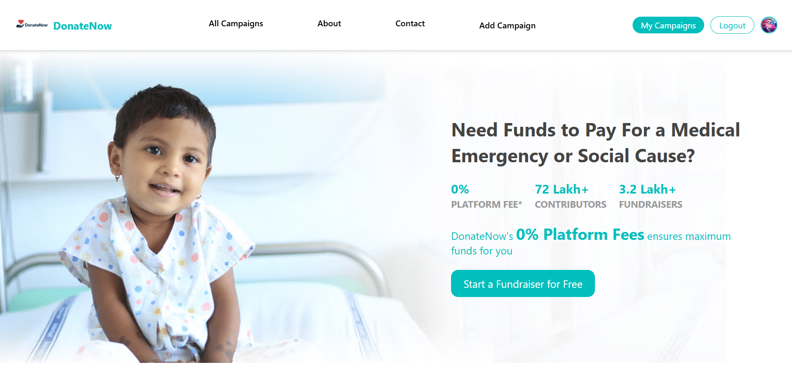

# DonateNow - Crowdfunding Platform

A full-stack crowdfunding platform that connects donors and campaigners through a secure, scalable, and elegant interface.

---

## Table of Contents

- [About the Project](#about-the-project)
- [Live Demo](#live-demo)
- [Features](#features)
- [Tech Stack](#tech-stack)
- [Screenshots](#screenshots)
- [Getting Started](#getting-started)
- [Folder Structure](#folder-structure)
- [API Endpoints](#api-endpoints)
- [Future Enhancements](#future-enhancements)
- [Author](#author)
- [License](#license)

---

## About the Project

**DonateNow** is part of the **donate.Now** capstone project. It is a modern full-stack crowdfunding platform built with the **MERN stack**.

Users can:

- Create fundraising campaigns
- Donate to causes
- Post comments
- Manage personal profiles

The platform emphasizes **security**, **responsiveness**, and **real-time interactions**.

---

## Live Demo

- [Live Project](https://ddonatenow.netlify.app/)  
- [GitHub Repo](https://github.com/nandan2506/donate.now)

---

## Features

-  User Authentication with JWT
-  Create, Edit & Delete Campaigns
-  Real-Time Comment System
-  Donation Tracking & Progress Visualization
-  Upload Display Image & Media URLs
-  Campaign Expiry Date Handling
-  Location-Based Campaign Filtering
-  Fully Responsive Design for all devices

---

## Tech Stack

### Frontend

- React.js
- Tailwind CSS
- React Router DOM
- React Icons
- React Toastify

### Backend

- Node.js
- Express.js
- MongoDB (Mongoose)
- Bcrypt.js
- JWT

### Dev Tools

- Visual Studio Code
- Git & GitHub
- Postman
- Netlify (Frontend)
- Render (Backend)

---

## Screenshots

### Home Page
donate.now\react_frontend\public\Screenshot.png


---

## Getting Started

### Prerequisites

- Node.js and npm installed
- MongoDB Atlas URI or local MongoDB setup

### Installation Steps

```
git clone https://github.com/nandan2506/donate.now.git
cd donate.now

# Backend setup
cd backend
npm install
npm run dev

# Frontend setup
cd ../react_frontend
npm install
npm run dev
```

### Folder Structure

```
DonateNow/
├── backend/
│   ├── controllers/
│   ├── models/
│   ├── routes/
│   ├── middlewares/
│   └── server.js
│
├── react_frontend/
│   ├── public/
│   └── src/
│       ├── components/
│       ├── pages/
│       ├── features/
│       ├── App.jsx
│       └── main.jsx
```

### API Endpoints

```
| Method | Endpoint                           | Description                      |
| ------ | ---------------------------------- | -------------------------------- |
| POST   | `/user/signup`                     | Register a new user              |
| POST   | `/user/login`                      | Login existing user              |
| GET    | `/campaign/allCampaigns`           | Get all campaigns                |
| GET    | `/campaign/Campaign/:campId`       | Get a campaign by ID             |
| GET    | `/campaign/myCampaign/:userId`     | Get campaigns by logged-in user  |
| POST   | `/campaign/newCampaign`            | Create a new campaign            |
| PATCH  | `/campaign/updateCampaign/:id`     | Update an existing campaign      |
| DELETE | `/campaign/deleteCampaign/:campId` | Delete a campaign                |
| POST   | `/comment/add_comment/:campId`     | Add a comment to a campaign      |
| DELETE | `/comment/delete_comment/:campId`  | Delete a comment from a campaign |
| POST   | `/donation/donate/:campaignId`     | Make a donation to a campaign    |

```

---

##  Future Enhancements

- Integrate real payment methods

- Email notifications using Nodemailer

- Add Unit and Integration Tests (Jest/Supertest)

- Admin Dashboard with Analytics

- Campaign Media Upload via Cloudinary

## Author

Nandan Singh Danu

- Based in Uttarakhand, India
- Full-Stack Web Developer (MERN)
- thenandansingh1999@gmail.com
- [LinkedIn](https://www.linkedin.com/in/nandan-singh-danu-125363343/)  
- [GitHub](https://github.com/nandan2506/)

---

## License

- This project is licensed for educational and showcase purposes.
